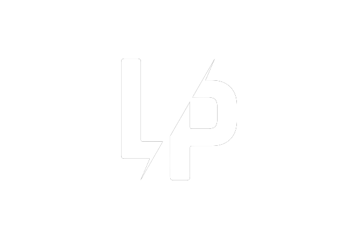

# LPObfuscator

LPObfuscator is a simple tool for obfuscating DayZ PBO files. It provides a user-friendly graphical interface to select a PBO file, apply a placeholder obfuscation technique, and save the obfuscated PBO.

## Features

- Obfuscate DayZ PBO files using a simple placeholder technique.
- Easy-to-use graphical interface.
- Browse for the input PBO file.
- Generate an obfuscated PBO file with a reversed content.

## How to Use

1. Download the latest release from the [Releases](https://github.com/<your_username>/<your_repository>/releases) page.
2. Extract the downloaded archive.
3. Run the `LPObfuscator.exe` executable.

### GUI Usage

1. Launch the application.
2. Browse for the PBO file you want to obfuscate.
3. Click the "Obfuscate" button to generate an obfuscated PBO.

## Disclaimer

LPObfuscator is intended for educational purposes only. Obfuscation techniques vary, and this tool's functionality is basic and for demonstration purposes.

## License

This project is licensed under the [MIT License](LICENSE).

---

